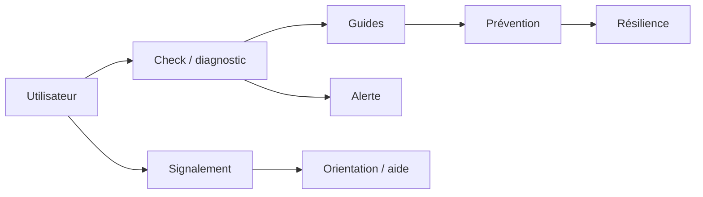

# HashCode Digital Safety

> Couche de protection et d'éducation numérique pour les citoyens, étudiants, enfants, créateurs, journalistes et petites organisations.

**Domaine:** Cybersecurity · **Programme:** HashCode Global Impact · **Statut:** Research / MVP discovery

## Problème
Les utilisateurs non techniques sont exposés au phishing, à la fraude, au vol de compte, à la sextorsion et à d'autres menaces sans toujours savoir quoi faire au moment critique.

## Vision
Rendre la sécurité numérique compréhensible, accessible et actionnable sur smartphone et avec une faible connectivité.

## Cartographie

## MVP
Vérification de liens, sécurité de compte, guides d'urgence, signalement, collecte prudente de preuves et orientation vers les services compétents.

## Principes
Aucune culpabilisation des victimes, minimisation des données, confidentialité, accessibilité et conseils compréhensibles.

## Impact
Utilisateurs aidés, incidents correctement orientés, temps de réaction et adoption des bonnes pratiques.

## Contribuer
Voir : https://github.com/HashCode-Reboot/hashcode-contributors

**Doctrine HashCode:** *Build for Africa. Scale for Humanity.*