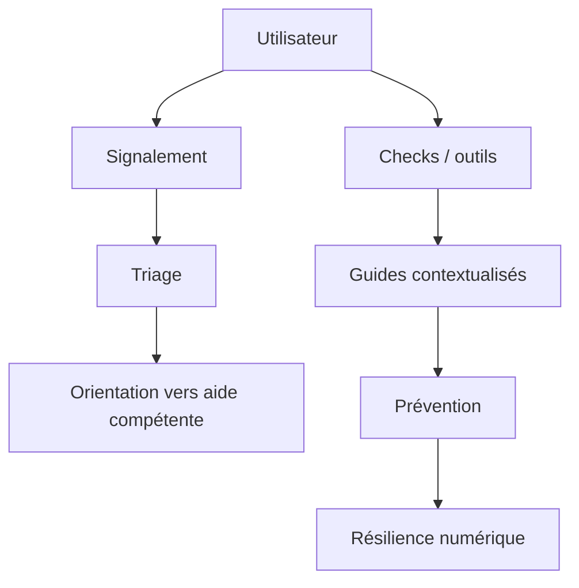

# Architecture — Digital Safety

## Principes

Interface simple, mobile-first, multilingue, faible connectivité, confidentialité et absence de culpabilisation. Les outils de détection fournissent des indications et non des accusations définitives.